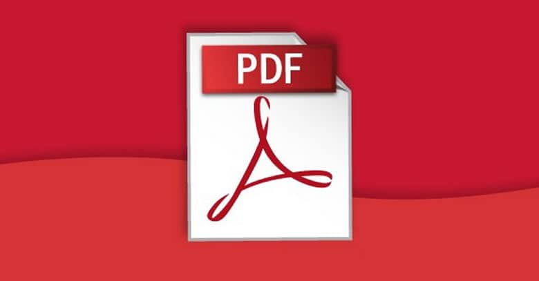

# PANTALLAS DEL SISTEMA

## 👍 Más pantallas
WIN-PUNTO

&#128516 
 

- [x] Tarea 1
- [ ] Tarea 2
- [ ] Tarea 3

## Símbolos Mtemáticos
Represetaciones con KaTEX

Area es $\pi r^2$

$$A_{tr}=\frac{b\cdot h}{2}
$$